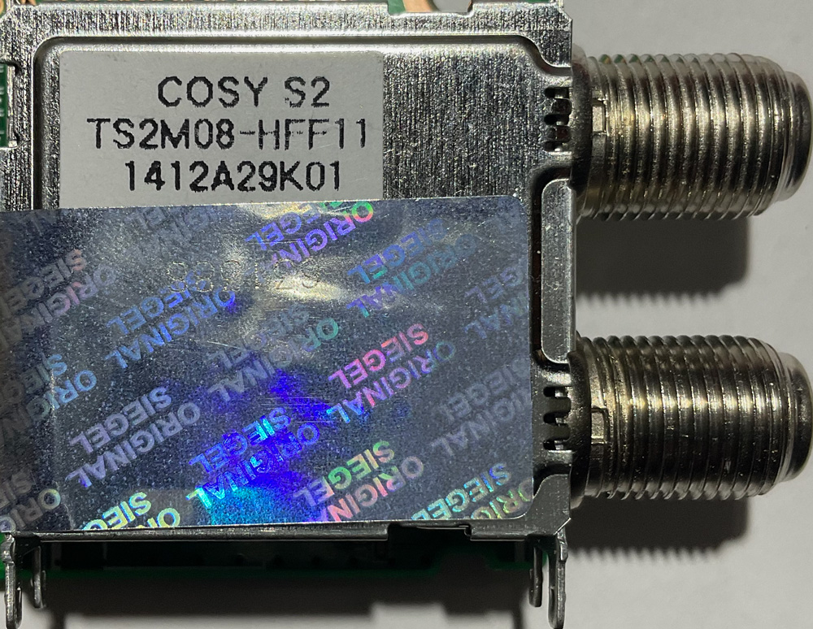
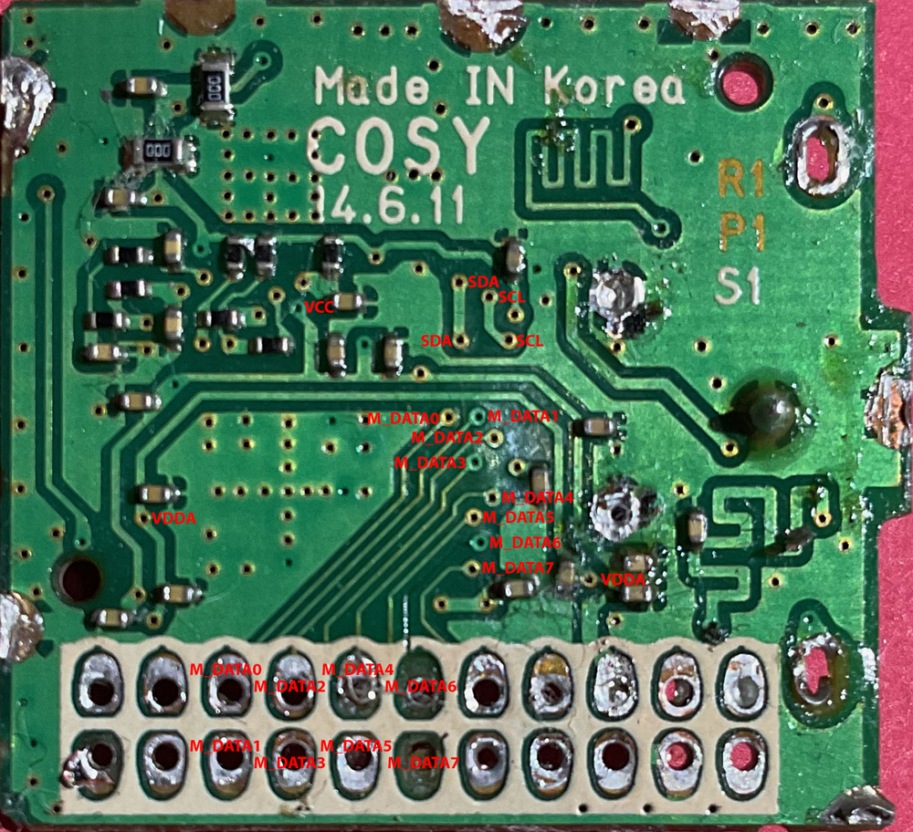
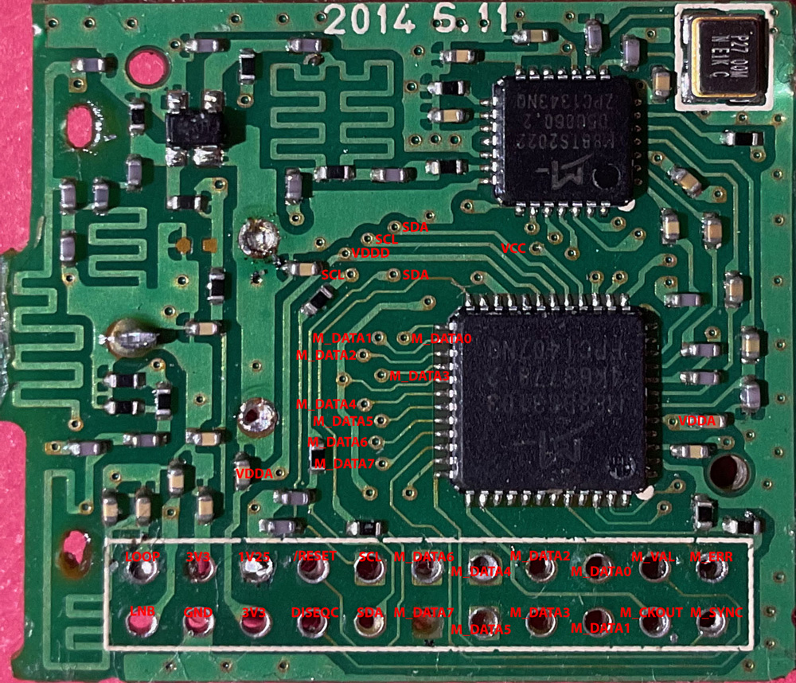
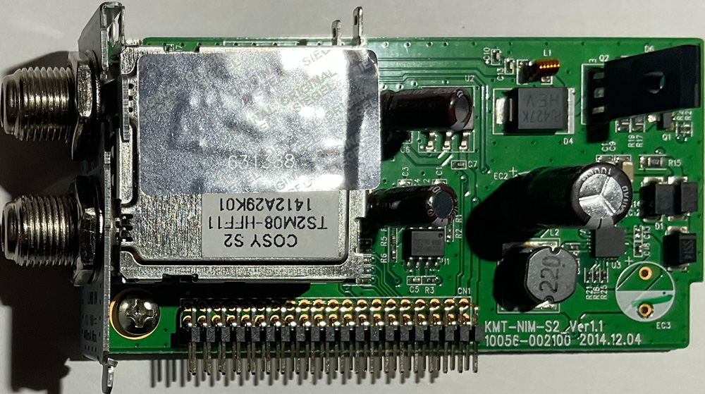

# Cosy TS2M08-HFF11

Pinout:

| Pin | Function |
| --- | -------- |
|   1 | LOOP     |
|   2 | 3V3      |
|   3 | 1V25     |
|   4 | /RESET   |
|   5 | SCL      |
|   6 | M_DATA6  |
|   7 | M_DATA4  |
|   8 | M_DATA2  |
|   9 | M_DATA0  |
|  10 | M_VAL    |
|  11 | M_ERR    |
|  12 | LNB      |
|  13 | GND      |
|  14 | 3V3      |
|  15 | DISEQC   |
|  16 | SDA      |
|  17 | M_DATA7  |
|  18 | M_DATA5  |
|  19 | M_DATA3  |
|  20 | M_DATA1  |
|  21 | M_CKOUT  |
|  22 | M_SYNC   |

